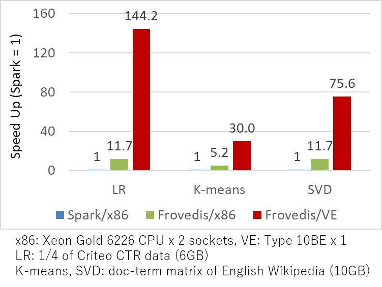

Frovedis:  
FRamework Of VEctorized and DIStributed data analytics
===

# 1. Introduction


Frovedis is high-performance middleware for data analytics. It is
written in C++ and utilizes MPI for communication between the servers.

It provides

- Spark-like API for distributed processing
- Matrix library using above API
- Machine learning algorithm library
- Dataframe for preprocessing
- Spark/Python interface for easy utilization

Our primary target architecture is SX-Aurora TSUBASA, which is NEC's
vector computer; these libraries are carefully written to support
vectorization. However, they are just standard C++ programs and can
run efficiently on other architectures like x86.

The machine learning algorithm library performs really well on sparse
datasets, especially on SX-Aurora TSUBASA. In the case of logistic
regression, it performed more than 10x faster on x86, and more than
100x faster on SX-Aurora TSUBASA, compared to Spark on x86.

In addition, it provides Spark/Python interface that is mostly
compatible with Spark MLlib and Python scikit-learn. If you are using
these libraries, you can easily utilize it. In the case of SX-Aurora
TSUBASA, Spark/Python runs on x86 side and the middleware runs on VE
(Vector Engine); therefore, users can enjoy the high-performance
without noticing the hardware details.

# 2. Installation

If you want prebuilt binary, please check
["releases"](https://github.com/frovedis/frovedis/releases),
which includes rpm file. If your environment is supported, using rpm
is the easiest way to install.

***Plaese make sure if your hostname (which can be obtained by hostname
command) is in /etc/hosts or registered in DNS to make it work correctly.***

If you want to build the framework on SX-Aurora TSUBASA, we recommend
to utilize our [build tools](https://github.com/frovedis/packaging)
together with [VE version of boost](https://github.com/frovedis/boost-ve).
Please follow the instructions in README.md of the build tools.

On other platforms, please follow the [instructions](doc/misc/how_to_build.md).

# 3. Getting started

Here, we assume that you have installed Frovedis from prebuilt binary.
Please also refer to /opt/nec/nosupport/frovedis/getting_started.md.

If you want to use VE version, you can set up your environment
variables by

    $ source /opt/nec/nosupport/frovedis/ve/bin/veenv.sh

If you want to use x86 version, please use following:

    $ source /opt/nec/nosupport/frovedis/x86/bin/x86env.sh

`${INSTALLPATH}` below is
`/opt/nec/nosupport/frovedis/ve/` in the case of VE, and
`/opt/nec/nosupport/frovedis/x86/` in the case of x86. 

## 3.1 C++ interface

Tutorial is [here](doc/tutorial/tutorial.md) in source code tree and
installed in `${INSTALLPATH}`/doc/tutorial/tutorial.[md,pdf]. 
The directory also contains [small programs](doc/tutorial/src)
that are explained in the tutorial. You can copy the source files into
your home directory and compile them by yourself. The Makefile and
Makefile.in.[x86, etc.] contains configurations for compilation, like
compilation options, path to include files, libraries, etc. You can
re-use it for your own programs.

The small programs in the tutorial directory looks like this:

```cpp
#include <frovedis.hpp>

int two_times(int i) {return i*2;}

int main(int argc, char* argv[]){
  frovedis::use_frovedis use(argc, argv);

  std::vector<int> v = {1,2,3,4,5,6,7,8};
  auto d1 = frovedis::make_dvector_scatter(v);
  auto d2 = d1.map(two_times);
  auto r = d2.gather();
  for(auto i: r) std::cout << i << std::endl;
}
```

This program creates distributed vector from std::vector, and doubles
its elements in a distribited way; then gathers to std::vector again.
As you can see, you can write distributed program quite easily and
consicely compared to MPI program.

In addition, there are also [sample programs](samples/) installed
in `${INSTALLPATH}`/samples directory. You can also use them as
reference when you write your own programs.

[Manuals](doc/manual/manual_cpp.md) are installed in
`${INSTALLPATH}`/doc/manual/manual_cpp.[md,pdf], which are more in
detail than the tutorial. Manuals for `man` command is also installed;
you can do like `man dvector`.

## 3.2. Spark/Python interface

You can utilize the predefined functionalities from Spark/Python,
which includes machine learning algorithms, matrix operations, and
dataframe operations.

This is implemented as a server; the server accepts RPC (remote
procedure call) to provide the above functionalities from Spark or
Python. The server can run on both VE and x86; if veenv.sh is
sourced, VE version of the server is used, if x86env.sh is sourced,
x86 version of the server is used.

To use the functionalities, you just need to modify importing packages
or modules and add few lines of codes from your Spark or Python
scikit-learn program.

For example, in the case of Spark, if the original program is:

    import org.apache.spark.mllib.classification.LogisticRegressionWithSGD
    ...
    val model = LogisticRegressionWithSGD.train(data)

Then, the modified program is:

    import com.nec.frovedis.mllib.classificaiton.LogisticRegressionWithSGD 
    ...
    FrovedisServer.initialize(...)
    val model = LogisticRegressionWithSGD.train(data)
    FrovedisServer.shut_down()

Here, importing package is changed, and server initialization and
shutdown is added. Other than that, you do not have to change the program.

In the case of Python / scikit-learn, if the original program is:

    from sklearn.linear_model import LogisticRegression
    ...
    clf = LogisticRegression(...).fit(X,y)

Then, the modified program is:

    from frovedis.mllib.linear_model import LogisticRegression
    ...
    FrovedisServer.initialize(...)
    clf = LogisticRegression(...).fit(X,y)
    FrovedisServer.shut_down()

Similary, only importing module is changed and server initialization
and shutdown is added. 

Tutorial for spark is [here](doc/tutorial_spark/tutorial_spark.md) in
source code tree and installed in
`${INSTALLPATH}`/doc/tutorial_spark/tutorial.[md,pdf].
Tutorial for python is [here](doc/tutorial_python/tutorial_python.md)
and installed in `${INSTALLPATH}`/doc/tutorial_python/tutorial.[md,pdf].

The directory also contains small programs that are explained in the
tutorial. You can copy the source files into your home directory and
run them by yourself. 

There are [other Spark demo programs](./src/foreign_if/spark/examples/) 
installed in `${X86_INSTALLPATH}`/foreign_if_demo/spark, and
[Python demo programs](./src/foreign_if/python/examples/) installed in 
`${X86_INSTALLPATH}`/foreign_if_demo/spark, where `${X86_INSTALLPATH}`
is `/opt/nec/nosupport/frovedis/x86/`.

To try them, please copy these directories into your home directory
(since it creates files). The scripts ./foreign_if_demo/spark/run_demo.sh 
and ./foreign_if_demo/python/run_demo.sh run demos. 

[Manuals for Spark](doc/manual/manual_spark.md) and
[manuals for Python](doc/manual/manual_python.md) 
are installed in
`${INSTALLPATH}`/doc/manual/manual_spark.[md,pdf] and 
`${INSTALLPATH}`/doc/manual/manual_python.[md,pdf]. 
Manuals for `man` command is also installed;
you can do like `man -s 3s logistic_regression` or 
`man -s 3p logistic_regression`.
Here, with `-s 3s` option, you can see Spark manual; 
with `-s 3p` option, you can see Python manual. 

# 4. Other documents

Below links would be useful to understand the framework in more detail:
- [List of ML algorithms](doc/misc/ml_algorithms.md)

# 5. License

License of this software is in LICENSE file. 

This software includes third party software. The third_party directory
includes third party software together with their licenses. 
